<!--
  ALIOZANK // PROFILE CONTROL ROOM

  Every panel below is one generated SVG at width 1000. Keep each panel as a
  single image: GitHub will scale it on narrow screens without breaking the
  composition. Run `python scripts/generate_profile.py` to rebuild all panels.

  `activity.svg` is refreshed every day by GitHub Actions. Edit
  `profile.config.json` for copy/links; do not hand-edit generated SVG files.
-->

