<!--
  ALIOZANK // PROFILE CONTROL ROOM

  Every panel below is one generated SVG at width 1000. Keep each panel as a
  single image: GitHub will scale it on narrow screens without breaking the
  composition. Run `python scripts/generate_profile.py` to rebuild all panels.

  `activity.svg` is refreshed every day by GitHub Actions. Edit
  `profile.config.json` for copy/links; do not hand-edit generated SVG files.
-->

  <a href="https://github.com/aliozank/Flight-Managment-System"><code>flagship system</code></a> ·
  <a href="https://github.com/aliozank/uys-lab"><code>engineering labs</code></a> ·
  <a href="https://github.com/aliozank/Java-notes-and-practice"><code>java practice</code></a> ·
  <a href="https://github.com/aliozank?tab=repositories"><code>all repositories</code></a>

<!-- Built as code. No external badge service, font, tracker or image host. -->
